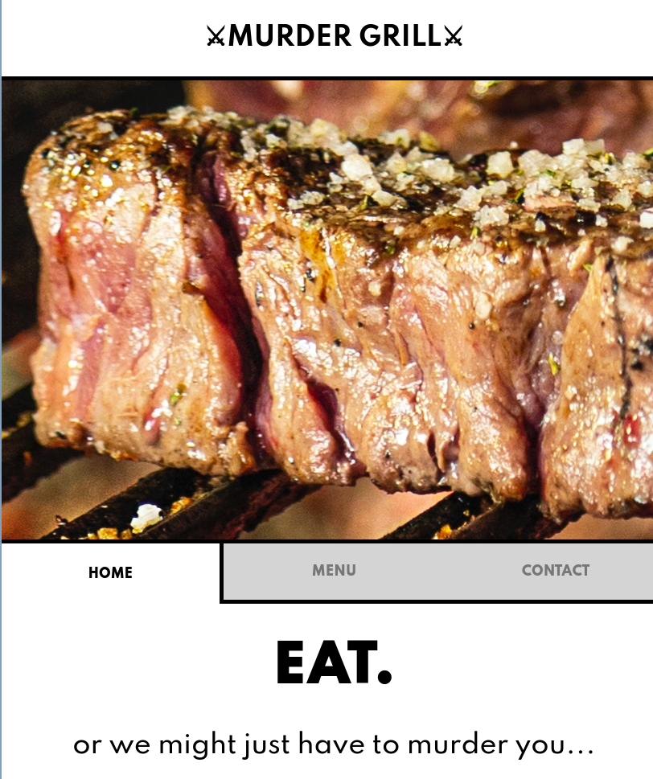

# Murder Grill

## Meat. Murder. Mayhem.

Alliteration.

An ironic / satirical webpage for a fictional grill place that *really* loves meat.

This is a group exercise from Social Hackers Academy where I learned more about npm and webpack, as well as the usage of modules in breaking down code components.

Every single element is dynamically being generated via JavaScript DOM manipulation as the actual HTML file only begins with a single empty div. The tabs themselves are switched dynamically in the same page as well.

## Notes:

Responsive for anything more than 320 pixels wide.
